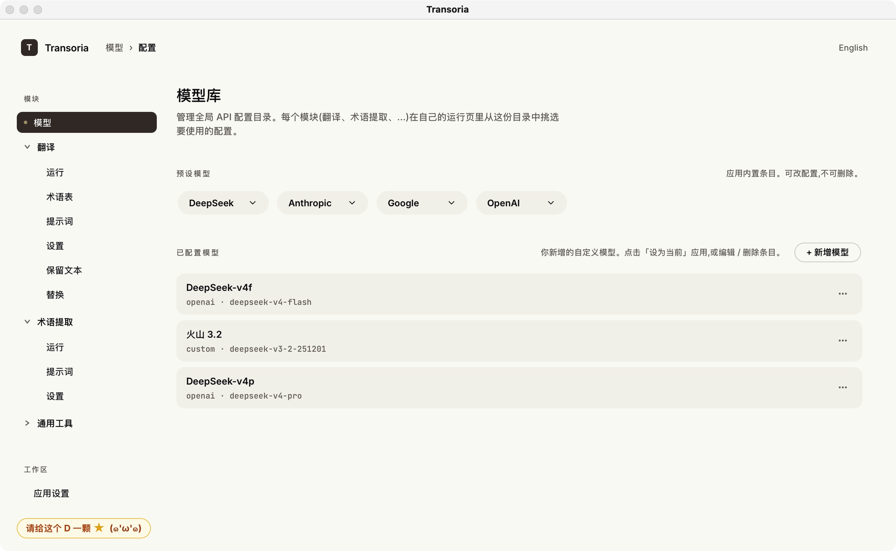
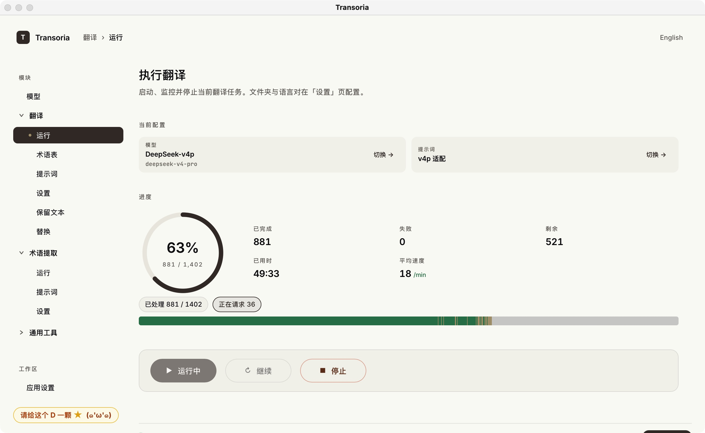

# Transoria

<p align="center">
  <strong><a href="#中文">中文</a></strong> ·
  <strong><a href="#english">English</a></strong>
</p>





---

## 中文

Transoria 是一个面向小说翻译的桌面应用：把一个装着 EPUB / TXT 的文件夹丢给它，得到翻译完成后的同结构文件夹。附带两个工具——**术语提取**（先扫一遍统计高频专有名词，作为翻译时的术语表）和**批量文本替换**（按规则在大量文件里做查找替换）。

界面支持中英文切换。所有任务在本地运行，由你自己的 LLM API Key 调用模型。

交流/问题反馈群qq：**1104197845**。欢迎加入，使用中遇到问题可以进群反馈。

### 下载安装包

最新版下载：**[GitHub Releases](https://github.com/oodadoudou/Transoria/releases)**

- **macOS** — `Transoria.dmg`，挂载后把 `Transoria.app` 拖到 `/Applications/`。首次启动若被 Gatekeeper 拦截，参考对应 Release 描述里的「macOS 用户须知」。
- **Windows** — `Transoria-windows.zip`。解压前请右键 ZIP → 属性 → 解除锁定 → 应用，再解压到一个普通可写目录（如「文档」或「桌面」），双击 `Transoria.exe`。包内 `README_CN.txt` 有完整说明。

### 跑源码（不用安装包）

适用场景：自定义 / 调试 / 在 Linux 上跑 / 安装包遇到问题想绕过。

**前置依赖**：Python ≥ 3.11、Node.js ≥ 18、[uv](https://github.com/astral-sh/uv)（推荐）或 `pip`。

#### macOS / Linux

```bash
git clone https://github.com/oodadoudou/Transoria.git
cd Transoria

# 后端依赖（含桌面 shell 所需）
uv sync --extra gui --extra dev
# 或： python -m pip install -e ".[gui,dev]"

# 前端构建
cd frontend
npm install
npm run build
cd ..

# 启动桌面应用
python app.py
```

#### Windows（PowerShell）

```powershell
git clone https://github.com/oodadoudou/Transoria.git
cd Transoria

# 后端依赖
python -m pip install -e ".[gui,dev]"

# 前端构建
cd frontend
npm install
npm run build
cd ..

# 启动桌面应用
python app.py
```

### 启动后第一步

1. 在「**模型**」页面新增或选择一个 LLM 配置，填入 API Key（DeepSeek / OpenAI / Anthropic / Google / 火山引擎 Ark 等均支持）。
2. 进入「**翻译**」/「**术语提取**」/「**通用工具 → 批量替换**」对应模块的「设置」页，指定输入文件夹与输出文件夹。
3. 回到该模块的「**运行**」页面点开始。

进度、token 用量、失败重试、日志都会在运行页面实时显示。

---

## English

Transoria is a desktop app for novel translation: drop a folder of EPUB / TXT files in, and get a same-structure folder of translated files out. It also bundles two tools — **glossary extraction** (scans the source first to collect recurring proper nouns as a translation glossary) and **batch text replacement** (rule-based find-and-replace across many files).

The UI ships with both Chinese and English. All tasks run locally and call models via your own LLM API key.

> Screenshots above show the Chinese UI; switch to English in the top-right of the app.

### Download

Latest builds: **[GitHub Releases](https://github.com/oodadoudou/Transoria/releases)**

- **macOS** — `Transoria.dmg`. Mount the DMG and drag `Transoria.app` into `/Applications/`. If Gatekeeper blocks the first launch, see the "Notes for macOS users" section of the release description.
- **Windows** — `Transoria-windows.zip`. Before extracting, right-click the ZIP → Properties → Unblock → Apply. Extract to a regular writable folder (Documents, Desktop, or a folder you create — not Program Files), then double-click `Transoria.exe`. Full instructions in the bundled `README_EN.txt`.

### Run from source (no installer)

Use this if you want to customize / debug / run on Linux / sidestep packaging issues.

**Prerequisites**: Python ≥ 3.11, Node.js ≥ 18, [uv](https://github.com/astral-sh/uv) (recommended) or `pip`.

#### macOS / Linux

```bash
git clone https://github.com/oodadoudou/Transoria.git
cd Transoria

# Backend dependencies (incl. desktop shell)
uv sync --extra gui --extra dev
# or: python -m pip install -e ".[gui,dev]"

# Frontend build
cd frontend
npm install
npm run build
cd ..

# Launch the desktop app
python app.py
```

#### Windows (PowerShell)

```powershell
git clone https://github.com/oodadoudou/Transoria.git
cd Transoria

# Backend dependencies
python -m pip install -e ".[gui,dev]"

# Frontend build
cd frontend
npm install
npm run build
cd ..

# Launch the desktop app
python app.py
```

### After launch

1. Open the **Model** page, add or pick an LLM configuration, and paste in your API key (DeepSeek / OpenAI / Anthropic / Google / Volcengine Ark are all supported).
2. Go to the **Settings** page of the module you want to use (**Translation** / **Glossary Extraction** / **General Tools → Batch Replacement**) and pick an input and output folder.
3. Back on that module's **Run** page, click Start.

Progress, token usage, retry counts, and logs all stream live on the run page.
